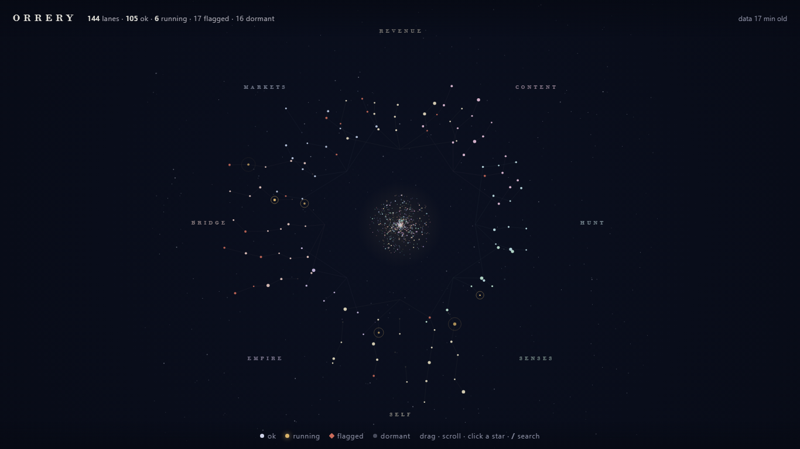
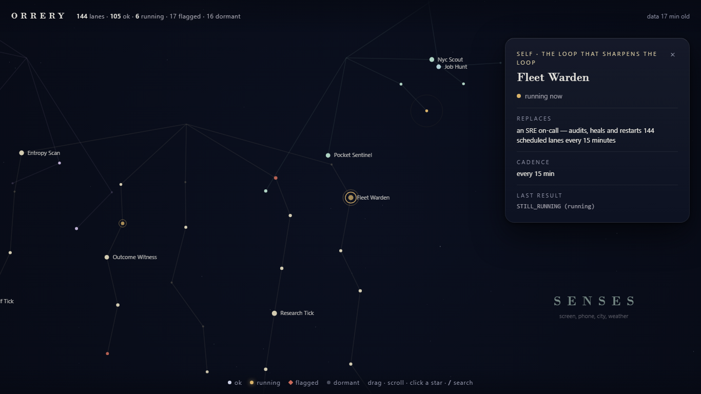

# ORRERY

**A live star-map of an AI company.** Every star is a real scheduled agent. Every
status is a real last-run result. The center is the brain; the constellations are
departments; dormant lanes fade like dead stars.

An [orrery](https://en.wikipedia.org/wiki/Orrery) is a working mechanical model of
the solar system. This is one for an agent fleet.





## Why this exists

Agent-company "mind maps" are everywhere on Instagram — and almost all of them are
diagrams of nothing: no live status, no real fleet behind the stars. This one
renders **my actual fleet** — 144 scheduled lanes that run a one-person company
from a Windows laptop in NYC — and it's open so you can render yours.

- **Zero dependencies.** One HTML file, canvas rendering, no build step.
- **Data-driven.** Point `data/fleet.json` at your own fleet; the page computes
  every count from the data — nothing is hardcoded.
- **Honest by design.** Data age is displayed in the header. Flagged lanes are
  red. Dormant lanes are dim. A map that only shows green is a brochure.

## Run it

```
npx serve         # or python -m http.server, or any static host
```

Open the page. Tap to enter. Drag to pan, scroll/pinch to zoom, click a star for
its card, `/` to search, arrows + Enter for keyboard, double-click to reset.

With no `data/fleet.json` present it renders a small sample fleet, so the clone
works before you've wired anything.

## Bring your own fleet

`data/fleet.json`:

```jsonc
{
  "meta": {
    "title": "ORRERY",           // wordmark + intro title
    "subtitle": "a live map of an AI company",
    "operator": "you",
    "exported": "2026-08-08T01:46:50Z"   // shown as data age — keep it honest
  },
  "departments": [
    { "id": "revenue", "label": "REVENUE", "hue": 42, "tagline": "money in" }
  ],
  "nodes": [
    {
      "id": "unique-id",
      "label": "Fleet Warden",
      "dept": "revenue",
      "status": "ok",            // ok | running | flag | dormant
      "detail": "last run result, verbatim",
      "cadence": "every 15 min", // optional
      "replaces": "an SRE on-call — audits and heals 144 lanes", // optional
      "mass": 3                  // 1-3 · flagships get labels at low zoom
    }
  ]
}
```

`gen-data.mjs` is the exporter I use — it reads my fleet supervisor's health
report and regenerates the JSON. Adapt it to whatever your scheduler emits
(cron, systemd timers, GitHub Actions, k8s CronJobs).

## Design notes

Planetarium, not dashboard. Two families (a spaced serif for constellation names,
a sans for instruments), seven type sizes, one accent color that always means
"alive". Status is never encoded by color alone — flagged stars are square,
dormant stars are faint. `prefers-reduced-motion` gets a still sky that renders
on interaction only. The full 60-point design checklist this was built against is
not in this repo, but the auditor's mechanical checks pass at zero FAILs.

## Limits (v1, stated rather than hidden)

- Static JSON — refresh cadence is whatever your exporter's is. No websocket.
- Canvas stars are announced to screen readers via a live region and the detail
  card is real DOM, but the map itself is not a substitute for a table view.
- Positions are deterministic from data order, not force-directed.

MIT.
